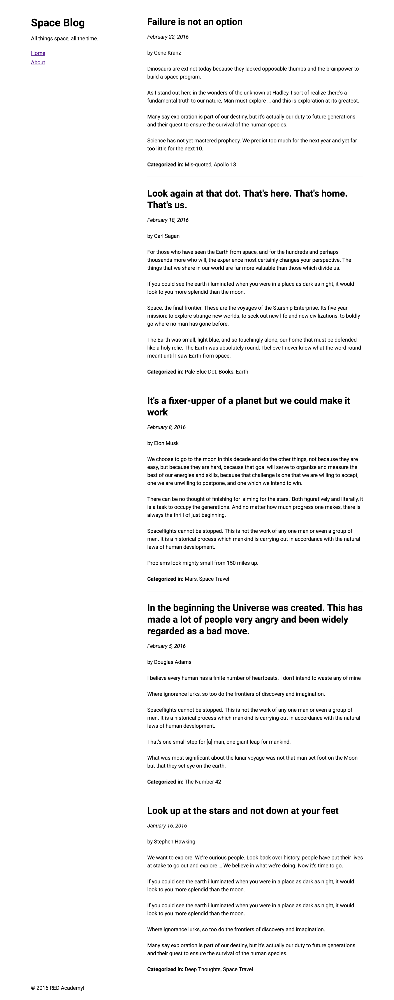
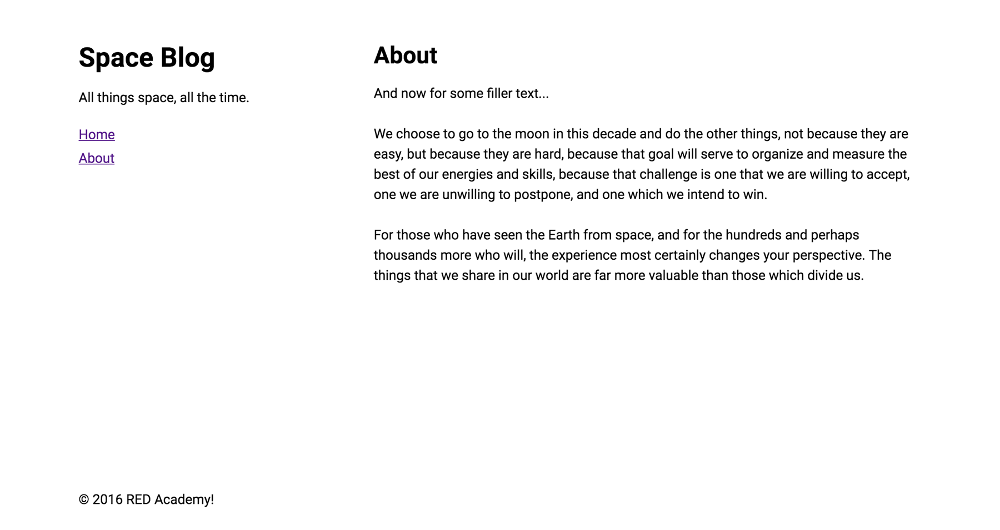

# PHP based blog
this is a lab activity from RED Academy Web Professional Program, Spring 2018.
## Let's create pseudo-blog called Space Blog.

+  “pseudo-blog” because there is no database or a UI for adding new content to the site (phew!). You will instead parse some provided post-like JSON-formatted data in PHP to create a site that looks like a blog.
+ created based on boilerplate files, with posts.json file—this is the file from which you will be dynamically displaying “blog” content.

What you need to do to complete this lab:
* Create a blog index page to display all the posts (by parsing the JSON data in PHP)
* Create an About page for the blog
* Dynamically include a header.php, sidebar.php, and footer.php file in each of the site’s pages (instead of including this mark-up statically on each page)
* Format the post data as per the design comp (e.g. posts will be displayed in reverse chronological order, categories name will be capitalized, and dates will be converted from Unix time to human-readable time)
* Abstract the functions you create into a functions.php file, and require it where needed (views are dumb…we don’t want any logic in our views!)
* Adequately reflect the designer’s vision for this site
;

